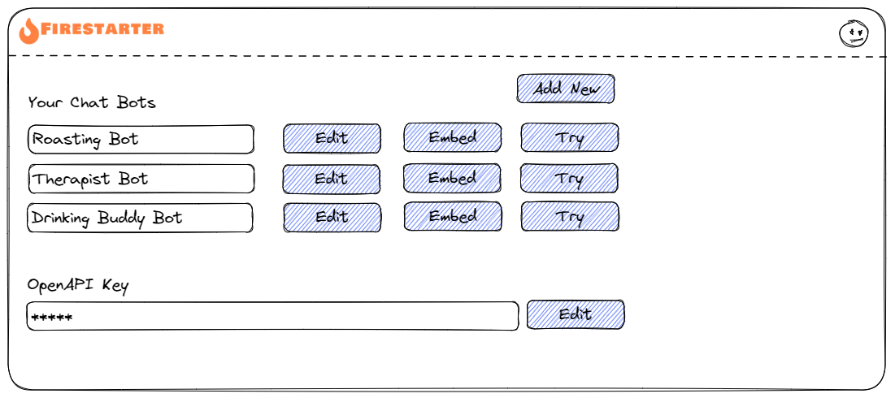
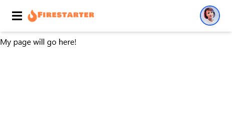

# Bot Management: Prologue

First we will set up Firestarter and create the bot management screen, which is this.



## Set up Firestater

Follow the setup guide link below to get Firestarter set up, then come back here after.

[Setup Guide](../../setup)

## Add a new page

In your project, under `nextjs/src/pages` add a new folder called `chatbot` and within that folder create a new file called `index.tsx`.

Put the following code in `index.tsx` to get started:

```typescript
import Layout from '@/components/Layout'

export default function Login() {

  return (
    <Layout>
      <p>My page will go here!</p>
    </Layout>
  )
}
```

If the development server isn't already running, run `yarn dev` from the command line from the `nextjs` folder.

Now visit [http://localhost:3000/chatbot](http://localhost:3000/chatbot) and you should see the new page:

{ .border }

## Add a navigation link

We are going to replace the default navigation items with a single link to this new page.

* Open `nextjs/src/components/Nav.tsx`
* You will see a section of navigation items like this:

```tsx
 <ul className="mr-auto lg:flex lg:flex-row">
    <li className="nav-item">
        <Link href="/todos" className="menu-item">
        Todos
        </Link>
    </li>
    <li className="nav-item">
        <Link href="/" className="menu-item">
        Team
        </Link>
    </li>
    <li className="nav-item">
        <Link href="/" className="menu-item">
        Projects
        </Link>
    </li>
</ul>
```

You can remove these `li` items, keeping the `ul` container, and then add one for the new page like this:

```tsx
<li className="nav-item">
    <Link href="/chatbot" className="menu-item">
    Your Bots
    </Link>
</li>
```

Now visit [http://localhost:3000](http://localhost:3000) check that this navigation item works and takes you to the page we have created.

## Add New Link

The management page has a link to add a new bot. We will include this link, by replacing the

```tsx
<p>My page will go here!</p>
```

With

```tsx
<Link href="/chatbot/new" className="button blue">
  Add New
</Link>
```

And add the required import for `Link` at the top:

```tsx
import Link from "next/link";
```

This button will be badly positioned on the page, but we will fix up styling and layout later.

We will now add the page that this links to creating a copy of `index.tsx` inside the `chatbot` folder and calling it `new.tsx`.

Now replace the content inside `<Layout></Layout>` with just the word "New" inside of `new.tsx` and test that the button links to this page.


## Rest of the owl?

There is a lot more to add to the management page, but we will come back to that. The next step is to make the new bot page work, so that we can add a bot, so that we have something to manage.

## Next steps

The next step in the tutorial is coming soon.

[New Bot Form >>>](chatbot-3.md){ .md-button }