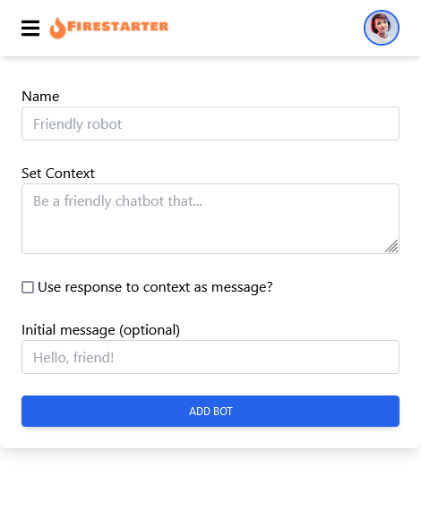

# New Bot Form

We know ahead of time that we will have a "New" and "Edit" screen and that they will be mostly similar. For this reason we will put the functionality in a component that can be used by both pages.

## Add and Edit component

Create a folder called `chatbot` under the `src/components` folder.

Create a file called `AddEditBot.tsx`

Paste in the following code to get started:

```tsx
import React from 'react';

export default function AddEditBot() {
    return <>
       AddEditBot Component
    </>;
}
```

Now reference this component from `pages/chatbot/new.tsx`, adding the import and replacing the contents of `<Layout>`:

```tsx

...
import Layout from "@/components/Layout";
...

...
    <Layout>
      <AddEditBot />
    </Layout>
...
```

When you visit [http://localhost:3000/chatbot/new](http://localhost:3000/chatbot/new) you sohuld see the words "AddEditBot Component" shown.

## Form

The Firestarter kit comes with a reference to [react-hook-form](https://react-hook-form.com/). Using this removes a lot of the boilerplate and tedium from creating forms in React, by handling the common mechanics of all forms like form validations.

Delete the entire contents of `AddEditBot.tsx`, and we will add the form code piece by piece, and I will explain what each does. Just paste each piece one after the other (the code wont compile until it is all in).

First add the imports:

```tsx
import React from "react";
import { FieldError, useForm } from "react-hook-form";
import { Alert } from "../Alert";
```

Below this, the type for the form data. This type helps `react-hook-form` and your code editor do good autocomplete, and for the compiler to spot bugs.

```tsx
type FormData = {
  name: string;
  context: string;
  useFirstResponseAsMessage: boolean;
  initialMessage: string;
};
```

Next, below this, add the component and statement that will make use for the `react-hook-form` library:

```tsx
export default function AddEditBot() {
  const {
    register,
    handleSubmit,
    formState: { errors },
  } = useForm<FormData>();
```

Add a helper to create error messages for any invalid inputs:

```tsx
  const fieldErrorAlertMsg = (err: FieldError | undefined) =>
    err && (
      <div className="mt-2">
        <Alert level="danger">{err.message}</Alert>
      </div>
    );
```

For now we add a form submit handler that does nothing. Later on this will be changed to save the bot and return to the management page.

```tsx
  const onSubmit = () => {};
```

Finally, the code that constructs the form HTML, specifies the validations and shows any validation errors:

```tsx
  return (
    <div className="block p-6 rounded-lg shadow-lg bg-white max-w-xl">
      <form onSubmit={handleSubmit(onSubmit)}>
        <div className="mb-6">
          <label>Name</label>
          <input
            {...register("name", { required: "Name is required" })}
            maxLength={100}
            type="text"
            className="input"
            aria-describedby="Name"
            placeholder="Friendly robot"
          />
          {fieldErrorAlertMsg(errors.name)}
        </div>
        <div className="mb-6">
          <label>Set Context</label>
          <textarea
            {...register("context", { required: "Context is required" })}
            maxLength={100}
            className="input"
            aria-describedby="Context"
            placeholder="Be a friendly chatbot that..."
          />
          {fieldErrorAlertMsg(errors.context)}
        </div>
        <div className="mb-6">
          <div className="block">
            <input
              {...register("useFirstResponseAsMessage")}
              type="checkbox"
              className="float-left relative mt-1.5 mr-1"
              aria-describedby="Use Response As Message"
            />
            <label className="inline-block">
              Use response to context as message?
            </label>
          </div>
        </div>
        <div className="mb-6">
          <label>Initial message (optional)</label>
          <input
            maxLength={100}
            type="text"
            className="input"
            aria-describedby="Initial Message"
            placeholder="Hello, friend!"
          />
        </div>
        <button type="submit" className="button blue w-full">
          Add Bot
        </button>

        {errors.root?.serverError && (
          <div className="mt-2">
            <Alert level="danger">{errors.root.serverError.message}</Alert>
          </div>
        )}
      </form>
    </div>
  );
}
```

Now view the page at [http://localhost:3000/chatbot/new](http://localhost:3000/chatbot/new), and it should look like this:



If you click "ADD BOT" now, it should show validation errors for the missing required fields.

If you fill them in and click "ADD BOT", nothing will happen as we haven't added the code to actually add the bot yet.

## Next steps

[New Bot Save >>>](chatbot-4.md){ .md-button }
